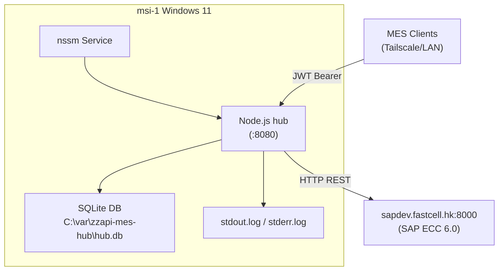

# Hub Deployment Plan — msi-1 (Windows 11)

> **Status**: Deployed and verified 2026-04-23 — service RUNNING at `C:\Users\karlchow\code\zzapi-mes-deploy\`; `/healthz?check=sap` returns `{"ok":true,"sap":"reachable"}`.
> **Target**: msi-1 (`100.103.147.52` Tailscale / `10.45.16.132` LAN)
> **Date**: 2026-04-23

## TL;DR

Deploy the zzapi-mes hub on msi-1 (Windows 11) as a native Node.js service using nssm. The existing `install.sh` is Linux-only; this document provides the Windows equivalent. SAP connectivity from msi-1 is confirmed.

## System Prerequisites (collected via SSH)

| Item | Value |
|------|-------|
| OS | Windows 11 64-bit |
| RAM | 16 GB |
| Node.js | v24.15.0 (`C:\Program Files\nodejs\node.exe`) |
| Git | 2.53.0 (`C:\Program Files\Git\cmd\git.exe`) |
| pnpm | **Not installed** |
| Docker/WSL | Not installed |
| Tailscale IP | 100.103.147.52 |
| LAN IP | 10.45.16.132 |
| SAP connectivity | `sapdev.fastcell.hk:8000` — reachable |

## Step-by-Step Deployment

### 1. Install pnpm

```powershell
npm install -g pnpm
pnpm --version   # verify
```

### 2. Install native module build tools

The hub depends on `better-sqlite3` and `argon2`, both with native C++ bindings. Node v24 ships with a compatible node-gyp, but Windows needs the Visual Studio C++ toolchain.

Check if build tools are present:

```powershell
npm config set msvs_version 2022   # or whatever VS version is installed
node -e "require('node-gyp')"       # will error if missing
```

If build tools are missing, install them:

```powershell
# Option A: Full VS Build Tools (preferred, ~6 GB)
winget install Microsoft.VisualStudio.2022.BuildTools --override "--add Microsoft.VisualStudio.Workload.VCTools --includeRecommended --passive"

# Option B: Quick install via npm
npm install -g windows-build-tools   # admin PowerShell required; may be deprecated on newer Node
```

After installation, restart the terminal and verify:

```powershell
npm config set msvs_version 2022
```

### 3. Clone and build the repo

```powershell
cd C:\Users\karlchow\code          # or preferred location
git clone <repo-url> zzapi-mes
cd zzapi-mes
pnpm install
pnpm build
```

If `pnpm install` fails on native modules, ensure step 2 is complete and retry.

### 4. Configure environment variables

Create the env file from the example:

```powershell
copy apps\hub\deploy\zzapi-mes-hub.env.example C:\etc\zzapi-mes-hub.env
```

Edit `C:\etc\zzapi-mes-hub.env` with production values:

```ini
HUB_PORT=8080
HUB_JWT_SECRET=<generate with: node -e "console.log(require('crypto').randomBytes(32).toString('base64'))">
# HUB_JWT_TTL_SECONDS=900         # JWT lifetime (default 900 = 15 min)
HUB_DB_PATH=C:\var\zzapi-mes-hub\hub.db
HUB_CORS_ORIGIN=*
# HUB_AUDIT_RETENTION_DAYS=90     # prune audit_log rows older than N days on startup
SAP_HOST=sapdev.fastcell.hk:8000
SAP_CLIENT=200
SAP_USER=<actual-user>
SAP_PASS=<actual-password>
```

Set system-level env vars (so the service can read them):

```powershell
# Run in admin PowerShell — OR use nssm env config (step 7)
[System.Environment]::SetEnvironmentVariable("HUB_PORT", "8080", "Machine")
[System.Environment]::SetEnvironmentVariable("HUB_JWT_SECRET", "<generated-secret>", "Machine")
[System.Environment]::SetEnvironmentVariable("HUB_DB_PATH", "C:\var\zzapi-mes-hub\hub.db", "Machine")
[System.Environment]::SetEnvironmentVariable("SAP_HOST", "sapdev.fastcell.hk:8000", "Machine")
[System.Environment]::SetEnvironmentVariable("SAP_CLIENT", "200", "Machine")
[System.Environment]::SetEnvironmentVariable("SAP_USER", "<actual-user>", "Machine")
[System.Environment]::SetEnvironmentVariable("SAP_PASS", "<actual-password>", "Machine")
```

Alternatively, nssm can set per-service env vars (preferred — avoids polluting system scope). See step 7.

### 5. Run DB migration

```powershell
mkdir C:\var\zzapi-mes-hub     # data directory
node apps\hub\dist\scripts\migrate.js
```

If using a custom `HUB_DB_PATH`, ensure it's set in the environment before running:

```powershell
$env:HUB_DB_PATH = "C:\var\zzapi-mes-hub\hub.db"
node apps\hub\dist\scripts\migrate.js
```

### 6. Create API keys

```powershell
node apps\hub\dist\admin\cli.js keys create --label "msi1-first" --scopes ping,po,prod_order,material,stock,routing,work_center,conf,gr,gi
```

Record the generated API key — it won't be shown again.

### 7. Set up as Windows service (nssm)

[nssm](https://nssm.cc/) — Non-Sucking Service Manager — wraps any executable as a Windows service.

```powershell
# Download nssm
winget install NSSM.NSSM     # or download from https://nssm.cc/download

# Install the service
nssm install zzapi-mes-hub

# In the nssm GUI that pops up, set:
#   Path:   C:\Program Files\nodejs\node.exe
#   Args:   C:\Users\karlchow\code\zzapi-mes\apps\hub\dist\index.js
#   Start directory: C:\Users\karlchow\code\zzapi-mes\apps\hub
#
#   I/O tab → Output: C:\var\zzapi-mes-hub\stdout.log
#   I/O tab → Error:  C:\var\zzapi-mes-hub\stderr.log
#
#   Environment tab — add env vars here instead of system-wide:
#     HUB_PORT=8080
#     HUB_JWT_SECRET=<generated-secret>
#     HUB_DB_PATH=C:\var\zzapi-mes-hub\hub.db
#     SAP_HOST=sapdev.fastcell.hk:8000
#     SAP_CLIENT=200
#     SAP_USER=<actual-user>
#     SAP_PASS=<actual-password>
```

Or via CLI (no GUI):

```powershell
nssm install zzapi-mes-hub "C:\Program Files\nodejs\node.exe" "C:\Users\karlchow\code\zzapi-mes\apps\hub\dist\index.js"
nssm set zzapi-mes-hub AppDirectory "C:\Users\karlchow\code\zzapi-mes\apps\hub"
nssm set zzapi-mes-hub AppStdout "C:\var\zzapi-mes-hub\stdout.log"
nssm set zzapi-mes-hub AppStderr "C:\var\zzapi-mes-hub\stderr.log"
nssm set zzapi-mes-hub AppEnvironmentExtra "HUB_PORT=8080" "HUB_JWT_SECRET=<secret>" "HUB_DB_PATH=C:\var\zzapi-mes-hub\hub.db" "SAP_HOST=sapdev.fastcell.hk:8000" "SAP_CLIENT=200" "SAP_USER=<actual-user>" "SAP_PASS=<pass>"
nssm set zzapi-mes-hub Start SERVICE_AUTO_START
nssm start zzapi-mes-hub
```

### 8. Verify

```powershell
# Health check (no auth required)
curl http://localhost:8080/healthz

# Health check with SAP reachability
curl "http://localhost:8080/healthz?check=sap"

# Get a JWT token (exchange API key for short-lived token)
$env:TOKEN = (curl -s http://localhost:8080/auth/token -d '{\"api_key\":\"<key_id>.<secret>\"}' -H 'content-type: application/json' | jq -r .token)

# Ping SAP round-trip (requires JWT)
curl -H "Authorization: Bearer $env:TOKEN" http://localhost:8080/ping

# Production order
curl -H "Authorization: Bearer $env:TOKEN" "http://localhost:8080/prod-order/000001001234"

# Metrics
curl http://localhost:8080/metrics
```

### 9. Log management

nssm writes to the configured log files. For rotation, use nssm's built-in rotation or a scheduled task:

```powershell
# nssm log rotation (rotate when file reaches 1 MB)
nssm set zzapi-mes-hub AppRotateFiles 1
nssm set zzapi-mes-hub AppRotateBytes 1048576
```

## Architecture (Windows Deployment)



## Post-Deployment Checklist

- [ ] pnpm installed and working
- [ ] Native modules (better-sqlite3, argon2) build successfully
- [ ] Repo cloned and `pnpm build` succeeds
- [ ] Env vars configured (HUB_JWT_SECRET, SAP_*)
- [ ] DB migration runs without errors
- [ ] API key created with all scopes
- [ ] nssm service installed and starts automatically
- [ ] `/healthz` returns 200
- [ ] `/ping` round-trips to SAP
- [ ] At least one business endpoint works (e.g., `/material/:matnr?werks=2000`)
- [ ] Log rotation configured
- [ ] Firewall rule allows :8080 on LAN/Tailscale if remote access needed

## Troubleshooting

| Symptom | Cause | Fix |
|---------|-------|-----|
| `pnpm install` fails on better-sqlite3 | Missing C++ build tools | Install VS Build Tools (step 2) |
| Service starts then stops immediately | Missing env vars or SAP unreachable | Check `stderr.log`, verify env vars in nssm |
| `401 Unauthorized` on /ping | Using raw API key instead of JWT | Exchange API key for JWT via `POST /auth/token`, then use `Bearer <jwt>` |
| `502 Internal proxy error` | SAP host unreachable from msi-1 | Verify `sapdev.fastcell.hk:8000` connectivity |
| Service won't start after reboot | nssm not set to AUTO_START | `nssm set zzapi-mes-hub Start SERVICE_AUTO_START` |

## Alternatives Considered

| Option | Pros | Cons | Decision |
|--------|------|------|----------|
| nssm | Simple, proven, per-service env vars | External binary | **Selected** — simplest for Windows service |
| pm2 + pm2-windows-service | Ecosystem, log management | Heavy, Node-specific issues on Windows | Rejected — overkill for single service |
| Windows Task Scheduler | No extra software | No service semantics (no auto-restart) | Rejected — not a real service |
| Docker Desktop | Consistent with Linux deploy | Not installed, heavy resource use | Rejected — not available on msi-1 |
| WSL2 | Linux compat | Not installed, networking complexity | Rejected — not available on msi-1 |
